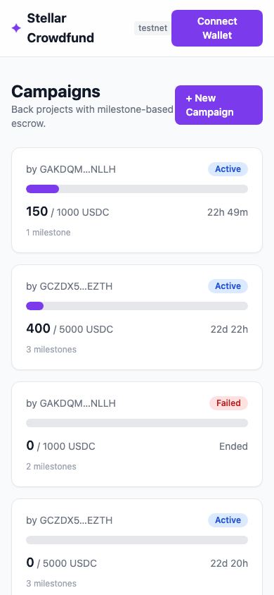
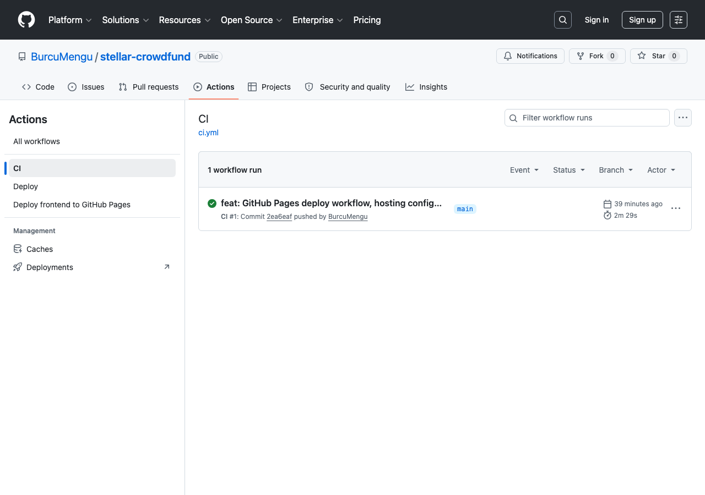
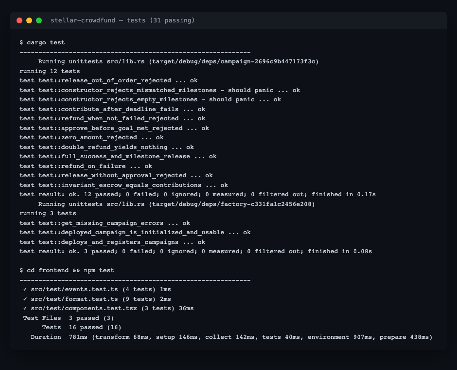

# Submission

Stellar Crowdfunding & Escrow dApp — milestone-based, all-or-nothing escrow on
Soroban, with a React frontend, full test suite, and CI/CD.

## Links

| Item | Link |
|---|---|
| **GitHub repository** | https://github.com/BurcuMengu/stellar-crowdfund |
| **Live demo** | https://burcumengu.github.io/stellar-crowdfund/ |
| **Demo video (1–2 min)** | _TODO: paste your YouTube/Loom link here_ |

## On-chain (Testnet)

| Item | Value |
|---|---|
| Network | Stellar Testnet |
| **Factory contract address** | `CALMUO52YPO5N22S4RVP7FYDEBKIOUP76TYKJ3O2FGJCK3G3N4RDLTP5` |
| USDC SAC (test token) | `CCA74LWCL4QS4CM3MCPTA7QI7WHGQ4F57GEW24T4JWYMSBFY63SIE4RP` |
| Example campaign | `CCSFXJHVEQ4M2YBMAWJMPD23DUPYQXCRNJBTQDG46WOXCFGHPOGGEI3L` |

### Transaction hashes (contract interactions)

| Interaction | Hash |
|---|---|
| **Contribute** (campaign escrow) | `b07ff77ad5b062ca793be07a9f4a2b3382b741250934aae5b06bcb9d629cb59d` |
| Factory deploy | `14311c07476c3274933e861dd7dde262f98dcf39481b1ce6d88a05c918e693c9` |
| Create campaign (via factory) | `e727415f33ee519879df48784cfe5a71b04ee279940e3cd44f3d48b2bc11080d` |

Explorer (contribute):
<https://stellar.expert/explorer/testnet/tx/b07ff77ad5b062ca793be07a9f4a2b3382b741250934aae5b06bcb9d629cb59d>

## Tests (3+ passing — actually 31)

```
# Contracts (Rust)
$ cargo test
   campaign:  12 passed
   factory:    3 passed

# Frontend (Vitest)
$ cd frontend && npm test
   16 passed
```

## Screenshots

Place images under `docs/screenshots/` and they will render below.

- **Mobile responsive UI** — `docs/screenshots/mobile.png`
- **CI/CD pipeline running** — `docs/screenshots/ci.png` (GitHub → Actions tab)
- **Test output (3+ passing)** — `docs/screenshots/tests.png`





## Requirements checklist

- [x] Public GitHub repository
- [x] README with complete documentation ([README.md](README.md))
- [x] 10+ meaningful commits
- [x] Live demo link (GitHub Pages)
- [x] Contract deployment address
- [x] Transaction hash for contract interaction
- [ ] Screenshots (mobile UI, CI/CD, tests) — add under `docs/screenshots/`
- [ ] Demo video link (1–2 min) — add above

## How to run locally

See [README.md](README.md#quick-start). TL;DR:

```bash
stellar contract build && cargo test         # contracts
cd frontend && npm install && npm run dev     # frontend (uses .env.production IDs)
```
